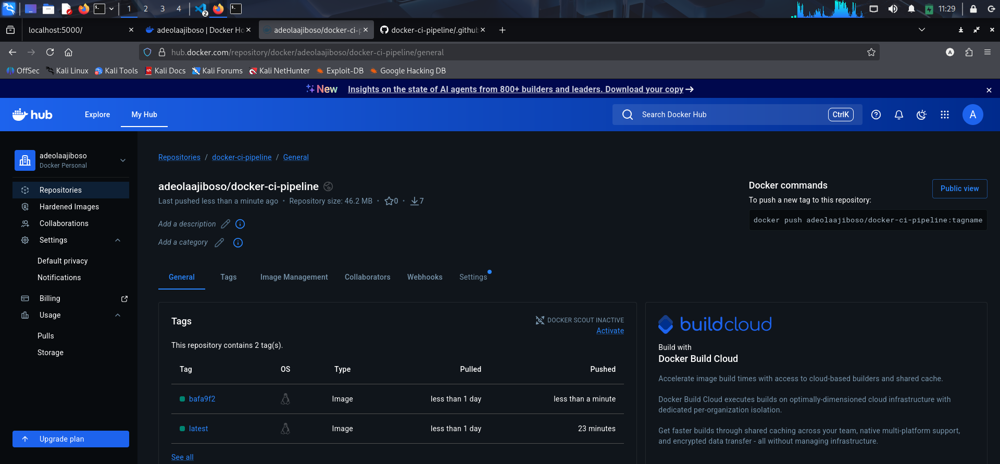

# Task Overview and Deliverables
This project uses GitHub Actions to automatically build and push Docker images.

## Screenshot showing a successful image push

## Short explanation on how tags are generated
- `latest` → always points to the newest build from the main branch
- `<commit-sha>` → a unique tag based on the Git commit hash

This allows:
- Easy access to latest version
- Rollback to specific versions using commit SHA
